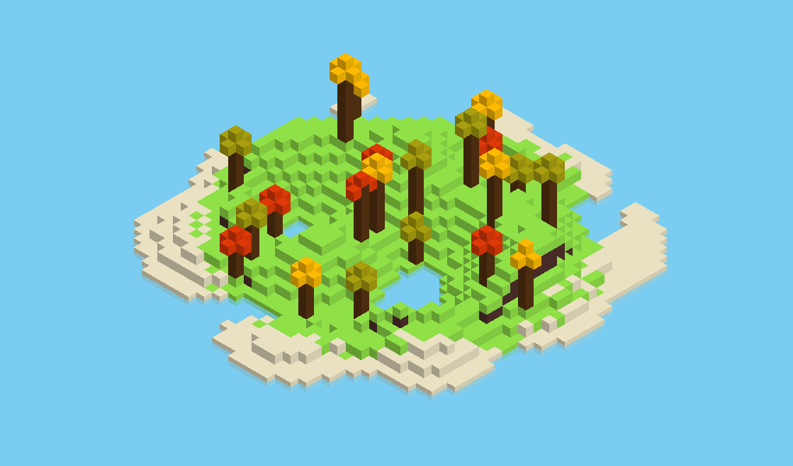
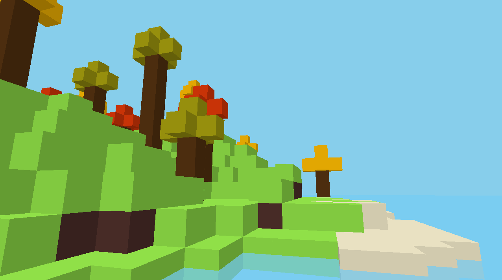

# [Boxes](https://benjiwong.com/boxes/)
**Boxes** is a very crude voxel engine, made for CS141's Extra Credit project opportunity.

Written in Rust and powered by the [Macroquad](https://macroquad.rs/) game engine, it generates a simple island using perlin noise, populated with beaches and trees. Islands are randomly generated on startup.

Note that this implementation of a voxel engine *isn't as optimal as it could be.* Nonetheless, it performs well (steady 60FPS average) on most systems.

[Play it here!](https://benjiwong.com/boxes/)

